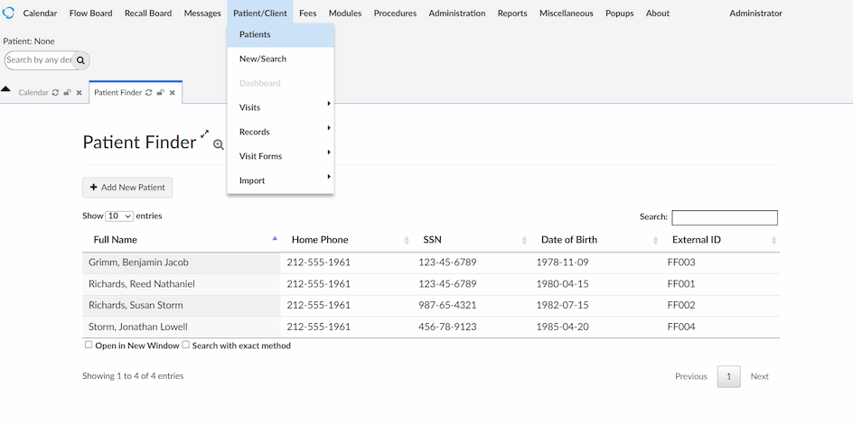

OpenEMR
==============
**OpenEMR** provides a centralized database to store and manage patient demographic information, medical history, vital signs, and visit information.


It is free software but **does not** support HL7 messages and for this I have developed an API to manage this type of communication and thus not depend on external APIs such as *Mirth*.

## 🔁HL7 API
This API acts as an intermediary translator between the `client_hl7.py` and the OpenEMR **database** itself. This is necessary because the HL7 message is a communication standard, but each hospital has its own way of storing data in its own custom structure.
Command to run the API with uvicorn:
```
$ uvicorn api_hl7:app --host=0.0.0.0 --port=5000
```
This is the workflow that will be performed on the endpoint:
>**🗒️API Code Flow**
>
> 1. The FastAPI server starts (last line with `uvicorn.run()`).
> 
> 2. A POST endpoint is exposed at `/api/hl7` to receive HL7 messages.
> 
> 3. When a request is received:
>   - The HL7 message is decoded.
>   - It is parsed using `hl7apy` to extract patient data.
>   - The information is formatted (names, address, gender, etc.).
>   - The data is inserted into the `patient_data` table in the MySQL database.
>   - An HL7 ACK (Acknowledgment) message is returned to the client.